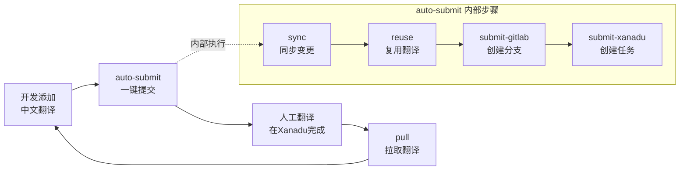
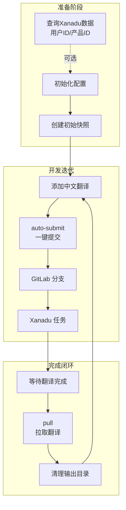

# i18n-tool 智能助手

我是 i18n-translate-tool 的专用助手，帮助管理多语言 YAML 翻译文件的完整生命周期。

## 使用场景

### 1. 初始化场景

**适合时机**：项目首次接入翻译管理

**你可以说**：
- "帮我初始化翻译配置"
- "配置 i18n 工具"
- "开始使用翻译同步"

**我会帮你**：
1. 分析项目结构，识别翻译文件位置
2. 生成 `.i18n-translate-tool-config.js` 配置文件
3. 创建初始快照

**详见**：[setup.md](setup.md)

---

### 2. 翻译提交流程（核心场景）

**适合时机**：开发中新增了中文翻译，需要完整流程提交到翻译平台

**你可以说**：
- "提交翻译"
- "走翻译流程"
- "同步并提交翻译"
- "一键提交翻译"

**完整流程**：



**auto-submit 内部自动执行**：
1. **sync** - 检测中文变更，同步到目标语言（生成空字符串）
2. **reuse** - 自动复用已有翻译，减少重复工作
3. **submit-gitlab** - 提交到 GitLab 创建分支
4. **submit-xanadu** - 同步到 Xanadu 创建任务

**完成后**：
- 输出分支名和任务信息，方便跟踪
- 后续执行 **pull** 拉取完成的翻译

**详见**：[submit-workflow.md](submit-workflow.md)

---

### 3. 查询 Xanadu 平台数据

**适合时机**：需要查询 Xanadu 平台的用户 ID、产品 ID 等信息用于配置

**你可以说**：
- "帮我查一下 Xanadu 用户列表"
- "查询产品 ID"
- "找一下张三的用户 ID"
- "XDR 对应的产品 ID 是多少"

**我会帮你**：
调用 Xanadu API 查询以下信息：

| 查询类型 | API 端点 | 用途 |
|---------|---------|------|
| 用户列表 | `GET /api/user/all_user` | 获取用户 ID（manager、translation_docker 等） |
| 产品列表 | `GET /api/product/all-product-list` | 获取产品 ID（product_id） |
| 项目列表 | `POST /api/project/list` | 获取已有项目 ID |

**需要配置**：`XANADU_COOKIE` 环境变量

**详见**：[xanadu-api.md](xanadu-api.md) - 详细的 API 调用命令和示例

**适合时机**：需要查询 Xanadu 平台的用户 ID、产品 ID 等信息用于配置

**你可以说**：
- "帮我查一下 Xanadu 用户列表"
- "查询产品 ID"
- "找一下张三的用户 ID"
- "XDR 对应的产品 ID 是多少"

**我会帮你**：
调用 Xanadu API 查询以下信息：

| 查询类型 | API 端点 | 用途 |
|---------|---------|------|
| 用户列表 | `GET /api/user/all_user` | 获取用户 ID（manager、translation_docker 等） |
| 产品列表 | `GET /api/product/all-product-list` | 获取产品 ID（product_id） |
| 项目列表 | `POST /api/project/list` | 获取已有项目 ID |

**需要配置**：`XANADU_COOKIE` 环境变量

---

### 4. 拉取翻译场景

**适合时机**：Xanadu 上的翻译已完成，需要更新到本地

**你可以说**：
- "拉取翻译"
- "从 GitLab 获取翻译"
- "把翻译同步回本地"

---

## 完整生命周期



## 快速参考

### 核心命令

| 阶段 | 命令 | 说明 |
|------|------|------|
| 本地同步 | `sync --target=en-US` | 检测变更，同步到目标语言 |
| 复用翻译 | `reuse --apply` | 自动填充已有翻译 |
| 一键提交 | `auto-submit --xanadu-project-id=<id>` | 同步→复用→提交GitLab→创建Xanadu任务 |
| 一键提交(新建项目) | `auto-submit --create-xanadu-project-name=<name>` | 同上，但创建新的Xanadu项目 |
| 拉取翻译 | `pull --branch <name>` | 从 GitLab 获取翻译 |

### 常用选项

| 选项 | 用途 |
|------|------|
| `--filter <path>` | 只处理特定目录，如 app/shop |
| `--xanadu-project-id <id>` | 使用已有 Xanadu 项目 |
| `--create-xanadu-project-name <name>` | 创建新的 Xanadu 项目（如：XDR-1.0.0） |

### 环境变量

```bash
export GITLAB_TOKEN=xxx        # GitLab API Token
export XANADU_COOKIE=xxx       # Xanadu Cookie
```

## 获取帮助

直接告诉我你的需求，例如：
- "帮我初始化翻译工具"
- "查询 Xanadu 用户列表"
- "走完整的翻译提交流程"
- "拉取 Xanadu 完成的翻译"

或查看详细文档：
- [setup.md](setup.md) - 初始化配置指南
- [xanadu-api.md](xanadu-api.md) - Xanadu API 查询命令
- [submit-workflow.md](submit-workflow.md) - 完整翻译提交流程
