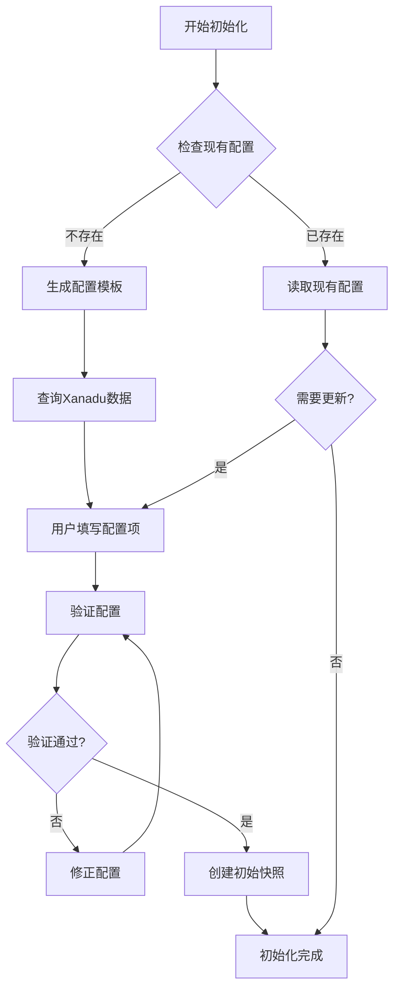

# 初始化场景指南

帮助项目首次接入 i18n-translate-tool，完成配置和初始设置。

## 工作流程



## 配置步骤

### 1. 查询 Xanadu 数据（可选）

在填写配置前，你可能需要查询 Xanadu 平台的用户 ID、产品 ID 等信息：

```
帮我查一下 Xanadu 用户列表
查询产品 ID
```

我可以帮你调用以下 API：

| 查询内容 | API 端点 | 配置字段 |
|---------|---------|---------|
| 用户列表 | `/api/user/all_user` | `manager`, `translation_docker`, `fe_docker` 等 |
| 产品列表 | `/api/product/all-product-list` | `product_id` |
| 项目列表 | `/api/project/list` | 已有 Xanadu 项目 ID |

**需要**：配置 `XANADU_COOKIE` 环境变量

**详见**：[xanadu-api.md](xanadu-api.md) - 详细的 curl 命令和调用示例

### 2. 创建配置文件

在项目根目录创建 `.i18n-translate-tool-config.js`：

```javascript
module.exports = {
  // 基础语言（源语言）
  baseLanguage: 'zh-CN',

  // 默认目标语言
  defaultTarget: 'en-US',

  // 扫描模式 - 根据实际项目结构调整
  // 必须包含 (* as locale) 来指定语言代码位置
  scanPatterns: [
    'app/(* as app)/config/locales/(* as locale)/*.yml',
  ],

  // 快照配置
  snapshot: {
    dir: 'i18n-translate-snapshot',
    pathPattern: '{app}/{locale}.yml',
  },

  // 翻译复用配置（可选）
  reuse: {
    outputFile: '.i18n-translate-tool-reuse.yml',
    ignoreValues: ['(i18n-no-translate)', '-', 'TODO'],
  },

  // 提交流程配置（可选，用于 GitLab/Xanadu 集成）
  submission: {
    outputDir: 'i18n-translate-submission',
    gitlab: {
      url: 'https://gitlab.example.com',
      projectId: 12345,
      token: process.env.GITLAB_TOKEN,
      baseBranch: 'main',
    },
    xanadu: {
      url: 'http://i18n.sangfor.com',
      taskType: 'Front-End',
      sourceLang: 'zh-CN',
      targetLang: 'en-US',
      personnel: {
        prDockerId: 0,
        translationDockerId: 0,
        commitDockerId: 0,
        managerId: 0,
        feDockerId: 0,
      },
      project: {
        level: 'normal',
        versionType: 'oversea',
      },
    },
  },
};
```

### 3. 填写配置项

**基础配置**：

| 配置项 | 说明 | 示例 |
|--------|------|------|
| `baseLanguage` | 源语言代码 | `'zh-CN'` |
| `defaultTarget` | 默认目标语言 | `'en-US'` |

**scanPatterns**：

根据项目翻译文件的实际路径填写。必须包含 `(* as locale)` 来指定语言代码位置。

**常见模式示例**：

```javascript
// 单层结构
'app/(* as app)/config/locales/(* as locale)/*.yml'

// 多层嵌套结构
'app/(* as app)/config/products/(* as product)/locales/(* as locale)/*.yml'

// 语言代码后有子目录
'app/(* as app)/config/locales/(* as locale)/*/*.yml'
```

**命名通配符语法**：
- `(* as locale)` - **必需**，用于识别语言代码位置
- `(* as name)` - 捕获路径段，可用于快照路径模式

**典型项目结构参考**：

```
app/
├── shop/
│   └── config/
│       └── locales/
│           ├── zh-CN/
│           │   └── entries.yml
│           └── en-US/
│               └── entries.yml
└── admin/
    └── config/
        └── locales/
            ├── zh-CN/
│           │   └── locales.yml
│           └── en-US/
│               └── locales.yml
```

### 4. 验证配置

创建配置后，运行验证：

```
验证 i18n 配置
检查配置文件是否正确
```

我会帮你检查：
- 配置文件格式是否正确
- scanPatterns 是否能匹配到文件
- 是否包含必需的 `(* as locale)` 模式
- 快照目录是否可创建

### 5. 创建初始快照

配置验证通过后，创建初始快照作为后续同步的基准：

```
创建初始快照
为目标语言创建快照
```

**快照的作用**：
- 记录基础语言（zh-CN）的当前状态
- 后续同步时用于检测变更
- 支持多目标语言独立管理

## 配置参考

### 最小配置（仅本地使用）

```javascript
module.exports = {
  baseLanguage: 'zh-CN',
  defaultTarget: 'en-US',
  scanPatterns: [
    'app/(* as app)/locales/(* as locale)/*.yml',
  ],
  snapshot: {
    dir: 'i18n-translate-snapshot',
    pathPattern: '{app}/{locale}.yml',
  },
};
```

### 完整配置（含 GitLab/Xanadu）

见上方完整模板。

## 常见问题

### Q: 配置文件在哪里？

项目根目录下的 `.i18n-translate-tool-config.js` 文件。

### Q: scanPatterns 怎么写？

根据你的翻译文件路径填写：
1. 找到语言代码所在位置（如 `zh-CN`、`en-US`）
2. 将该位置替换为 `(* as locale)`
3. 其他可变路径段可以用 `(* as name)` 捕获

### Q: 扫描不到文件？

检查 scanPatterns 是否正确：
1. 确认路径相对于项目根目录
2. 确认包含 `(* as locale)` 模式
3. 确认文件扩展名是 `.yml` 而非 `.yaml`

### Q: 多个产品模块如何配置？

在 pattern 中添加多个命名通配符：

```javascript
scanPatterns: [
  'app/(* as app)/config/products/(* as product)/locales/(* as locale)/*.yml',
],
snapshot: {
  pathPattern: '{app}/{product}/{locale}.yml',
}
```

## 下一步

初始化完成后，可以：
- 进入[提交流程](submit-workflow.md)进行翻译同步和提交
