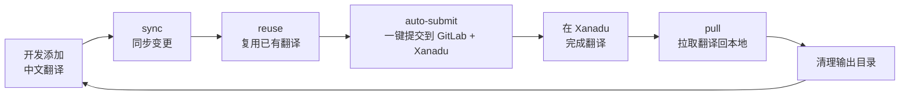
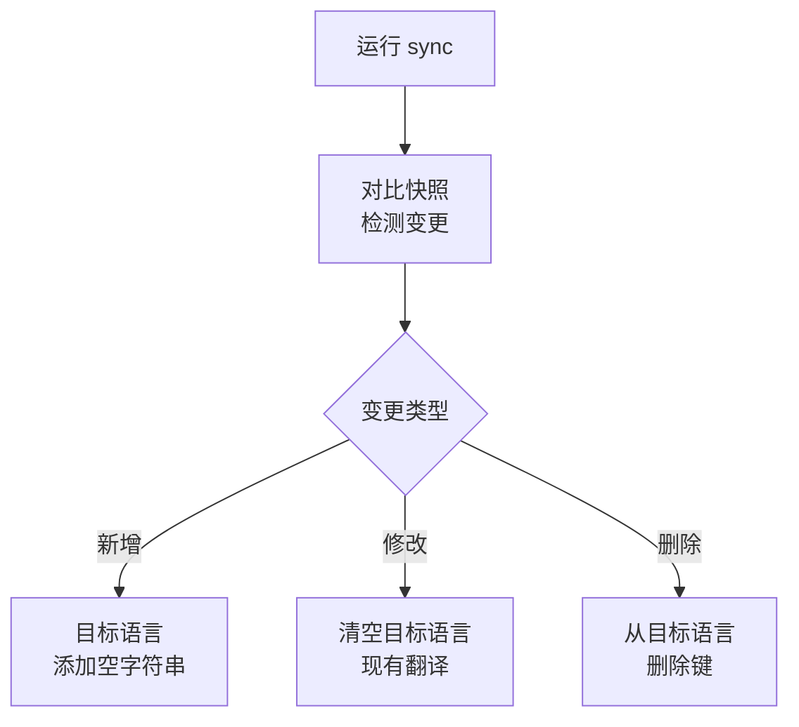
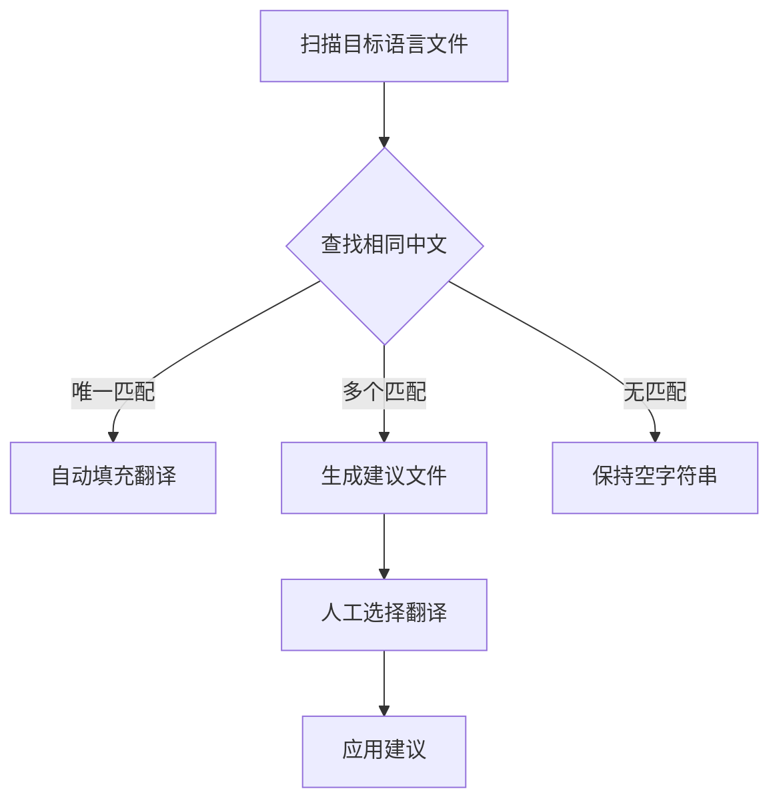
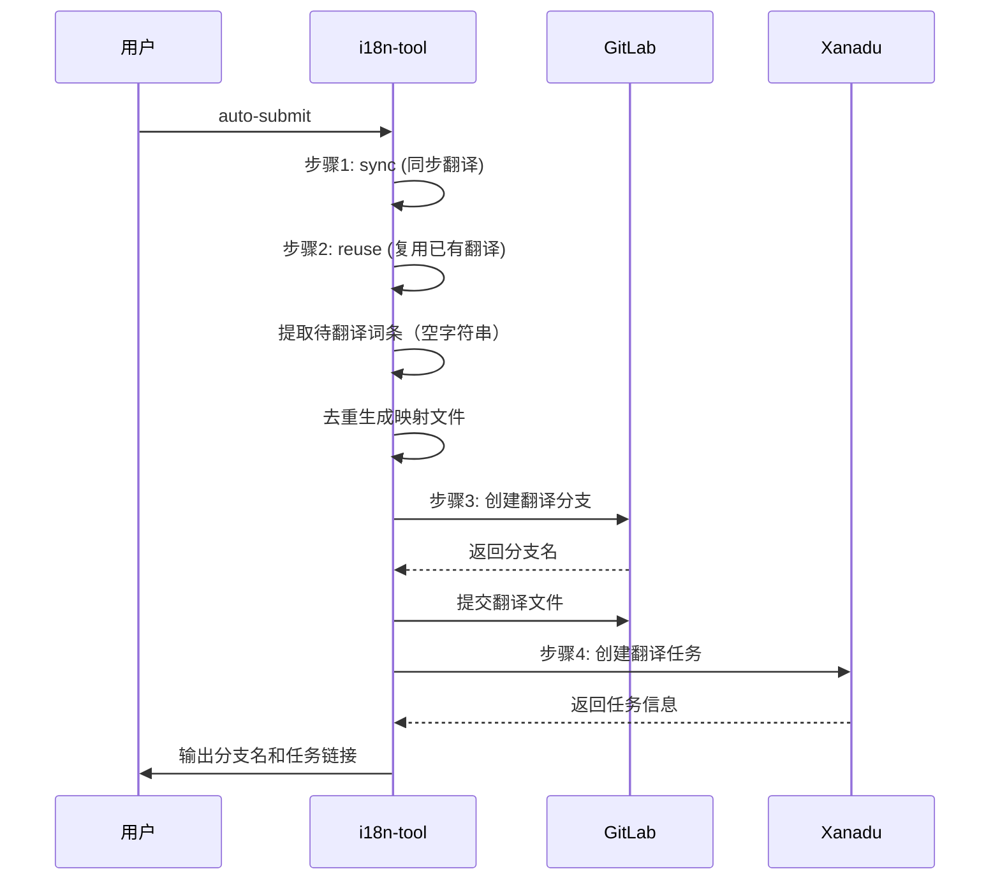
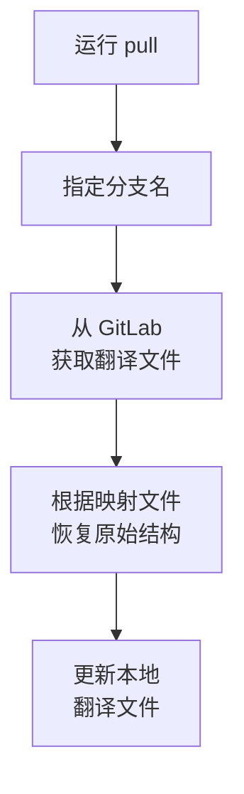

# 翻译提交流程指南

完整的翻译提交流程：本地同步 → 复用翻译 → 提交 GitLab → 同步 Xanadu → 拉取翻译。

## 完整流程概览



## 各阶段详解

### 第1阶段：本地同步 (sync)

**目的**：将中文文件的变更同步到目标语言文件

**工作流程**：



**同步行为示例**：

```yaml
# 新增键 - 添加空字符串
# zh-CN                     # en-US (同步后)
new_feature: "新功能"   ->   new_feature: ""

# 修改键 - 清空现有翻译
# zh-CN (变更前)            # en-US
old_desc: "旧描述"     ->   old_desc: "Old desc"
# zh-CN (变更后)            # en-US (同步后)
new_desc: "新描述"     ->   new_desc: ""

# 删除键 - 同步删除
# zh-CN                     # en-US (同步后)
# (deleted)            ->   # (deleted)
```

**你可以说**：
- "同步翻译到英文"
- "只同步 shop 模块的翻译"
- "预览翻译变更"

---

### 第2阶段：复用翻译 (reuse)

**目的**：自动查找相同中文内容的已有翻译，减少重复翻译工作

**工作原理**：



**复用示例**：

```yaml
# 唯一匹配 - 自动填充
# zh-CN                          # en-US
common.title: "产品标题"    ->    common.title: "Product Title"
widget.title: "产品标题"    ->    widget.title: "Product Title"  # 自动填充

# 多个匹配 - 生成建议
# 中文 "提交订单" 有多个翻译：
#   - "Submit Order" (来自 ui.yml:button)
#   - "Place Order"  (来自 checkout.yml:confirm)
# 生成建议文件供选择
```

**你可以说**：
- "复用已有翻译"
- "应用翻译建议"

---

### 第3阶段：远程提交 (auto-submit)

**目的**：一键完成完整流程：本地同步 → 复用翻译 → 提交 GitLab → 同步 Xanadu

**工作流程**：



**优势**：
- 一步完成 GitLab + Xanadu，无需手动管理分支名
- 自动处理去重和映射
- 减少出错机会

**你也可以分步执行**：
1. `submit-gitlab` - 仅创建 GitLab 分支
2. `submit-xanadu --branch <name>` - 手动同步到 Xanadu

**你可以说**：
- "一键提交翻译"
- "提交到 GitLab 和 Xanadu"

---

### 第4阶段：拉取翻译 (pull)

**目的**：Xanadu 翻译完成后，将翻译拉取回本地

**工作流程**：



**你可以说**：
- "拉取翻译"
- "从分支 translations-xxx 拉取"

---

## 配置要求

### GitLab 配置

```javascript
submission: {
  outputDir: 'i18n-translate-submission',
  gitlab: {
    url: 'https://gitlab.example.com',
    projectId: 12345,           // 数字类型
    token: process.env.GITLAB_TOKEN,
    baseBranch: 'main',
  },
}
```

### Xanadu 配置

```javascript
submission: {
  xanadu: {
    url: 'http://i18n.sangfor.com',
    taskType: 'Front-End',
    sourceLang: 'zh-CN',
    targetLang: 'en-US',
    personnel: {
      prDockerId: 26,
      translationDockerId: 26,
      commitDockerId: 26,
      managerId: 26,
      feDockerId: 26,
    },
    project: {
      level: 'normal',
      versionType: 'oversea',
    },
  },
}
```

### 环境变量

```bash
export GITLAB_TOKEN=xxx        # GitLab API Token
export XANADU_COOKIE=xxx       # Xanadu Cookie（必需）
```

## 完整示例

```
开发者: "走翻译提交流程"

Claude:
  1. 执行 sync --target=en-US
     - 检测到 5 个新增键、2 个修改键
     - 同步到 en-US 文件

  2. 执行 reuse --apply
     - 3 个键自动复用已有翻译
     - 4 个键保持空字符串等待翻译

  3. 执行 auto-submit --target=en-US --xanadu-project-id=1756
     - 创建 GitLab 分支: translations-20260323-143022
     - 同步到 Xanadu，任务已创建

  4. 输出信息:
     - 分支名: translations-20260323-143022
     - Xanadu 项目: 1756
     - 待翻译词条: 4 个

开发者完成 Xanadu 翻译后:

  5. 执行 pull --branch translations-20260323-143022
     - 拉取翻译到本地
     - 自动清理输出目录
```

## 常见问题

### Q: 只想同步到本地，不提交到远程？

执行到第2阶段即可：
```
同步翻译并复用已有翻译
```
（执行 sync + reuse，不执行 auto-submit）

### Q: 如何只提交特定目录？

```
只提交 shop 模块的翻译
```
（使用 --filter=app/shop 选项）

### Q: 拉取翻译后文件格式不对？

可能是映射文件丢失。确保使用同一版本的工具，或检查 `translation-mapping.json` 是否存在。

## 下一步

- 返回[主文档](SKILL.md)查看其他场景
- 查看[初始化指南](setup.md)配置新项目
